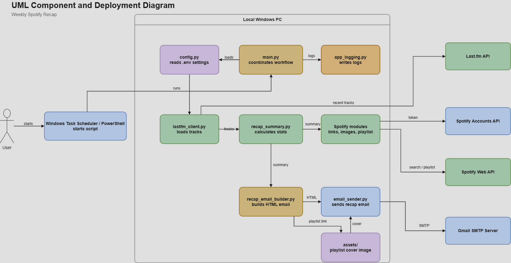
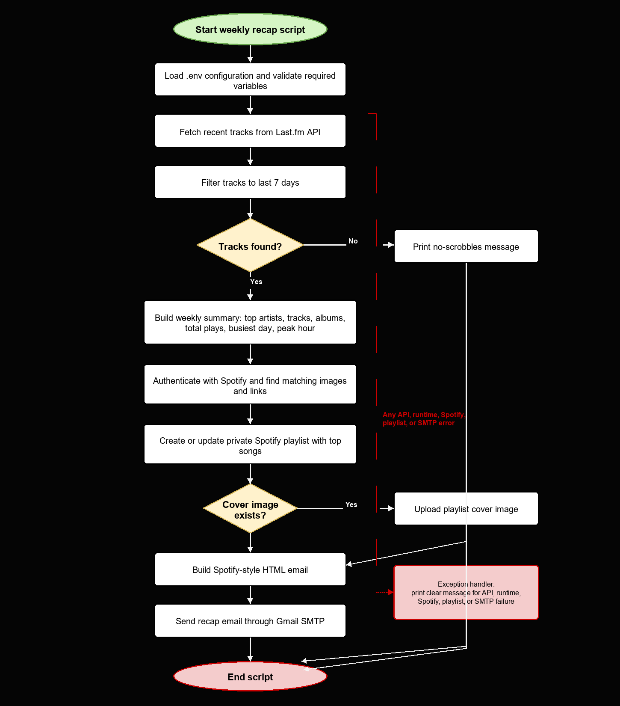

# Diagram Explanation

This page explains the two UML diagrams used in the project documentation.

## Component and Deployment Diagram

The component and deployment diagram shows how the project is split into Python
modules and which external services are used.

The script runs on a local Windows PC. It can be started manually with
PowerShell or automatically with Windows Task Scheduler. `main.py` starts the
workflow, loads the configuration from `.env`, and writes log output through
`app_logging.py`.

The main workflow loads recent listening data from the Last.fm API, calculates
the weekly recap, enriches the data with Spotify images and links, creates or
updates the Spotify playlist, builds the HTML email, and sends it through Gmail
SMTP.

External services shown in the diagram:

- Last.fm API provides the recent listening history.
- Spotify Accounts API provides the access token.
- Spotify Web API provides track search, images, links, and playlist updates.
- Gmail SMTP Server sends the final recap email.

## Detailed Activity Diagram

The activity diagram shows the order of the weekly recap process.

The script first loads the `.env` configuration and requests recent tracks from
Last.fm. If no tracks are found, the program prints a readable message and stops.
If tracks are found, the program builds the weekly summary, adds Spotify images
and links, creates or updates the playlist, builds the Spotify-style HTML email,
and sends the email through Gmail SMTP.

The red error path shows what happens if an API call, playlist step, or SMTP
step fails. The error is written to the log file and a readable error message is
printed for the user.
