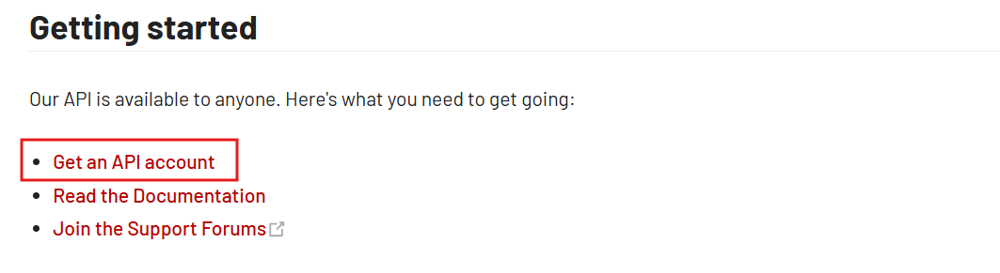
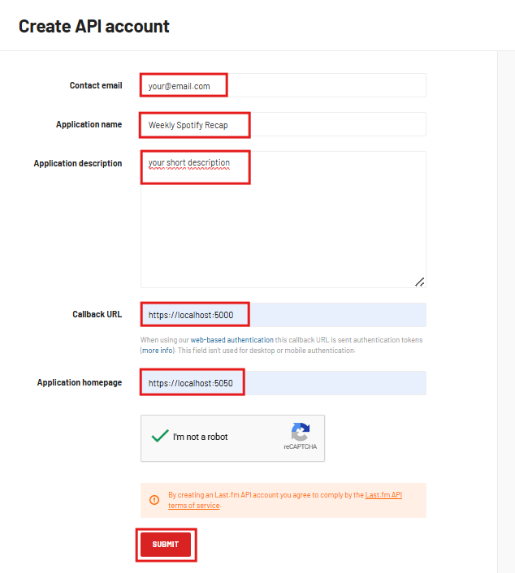
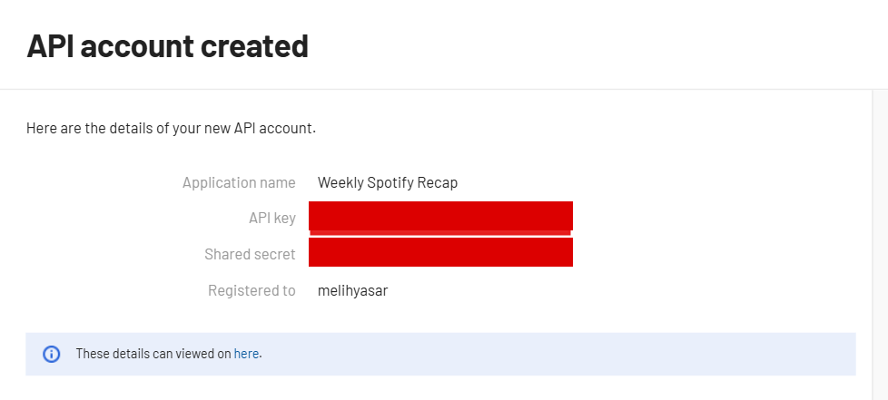
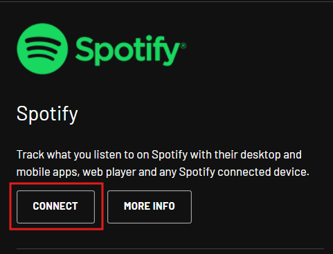
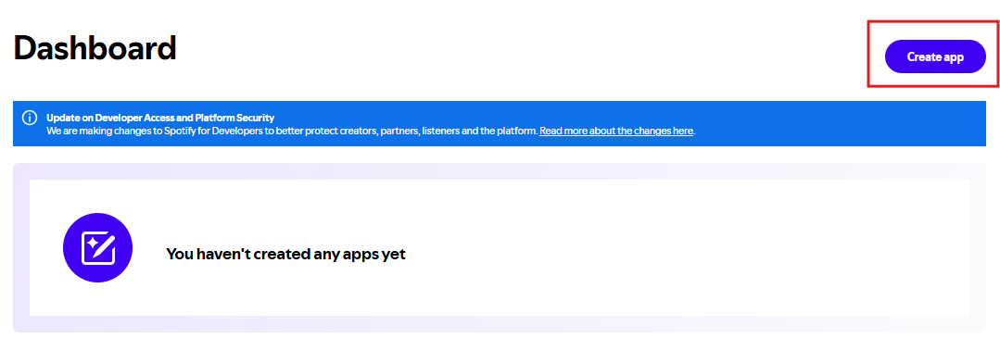
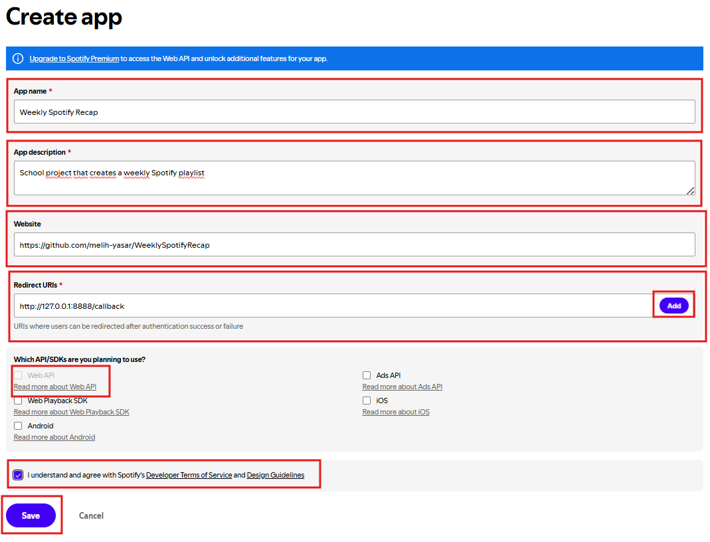
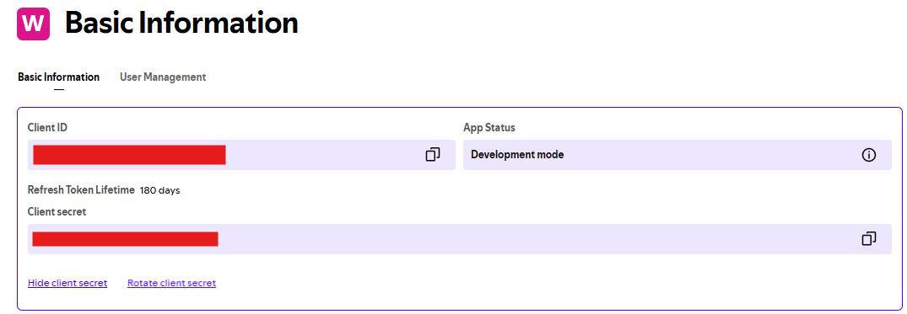
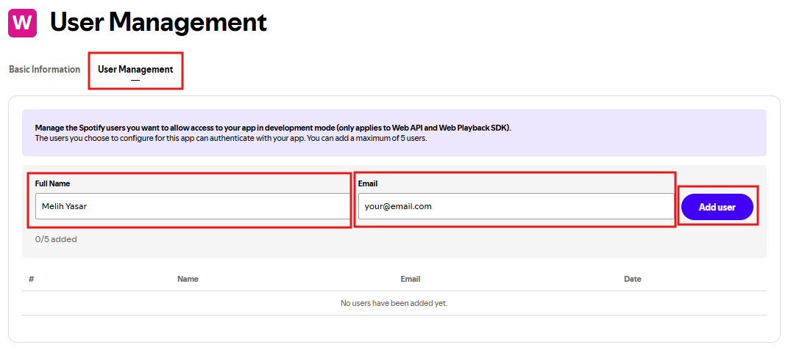

# Setup

## Visual overview

Official setup links:

| Topic | Official link |
| --- | --- |
| Python | [Python downloads](https://www.python.org/downloads/) |
| Last.fm API | [Last.fm API](https://www.last.fm/api) |
| Last.fm Spotify scrobbling | [Track My Music](https://www.last.fm/about/trackmymusic) |
| Spotify Developer Dashboard | [Spotify Developer Dashboard](https://developer.spotify.com/dashboard) |
| Spotify authorization code flow | [Authorization code flow](https://developer.spotify.com/documentation/web-api/tutorials/code-flow) |
| Spotify scopes | [Spotify scopes](https://developer.spotify.com/documentation/web-api/concepts/scopes) |
| Google app passwords | [Google app passwords](https://support.google.com/accounts/answer/185833) |
| Gmail SMTP settings | [Gmail SMTP settings](https://support.google.com/mail/answer/7126229) |

## 1. Create a virtual environment

```powershell
py -m venv .venv
.\.venv\Scripts\Activate.ps1
```

## 2. Install dependencies

```powershell
pip install -r requirements.txt
```

## 3. Create a Last.fm API account

1. Go to the official Last.fm API page: <https://www.last.fm/api>
2. Log in with your Last.fm account.
3. Click **Get an API account**.



4. Fill in the application form.
   - Application name: `Weekly Spotify Recap`
   - Description: `School project that reads my weekly Last.fm listening data`
   - Application homepage: you can use your GitHub repository link
   - Callback URL: leave it empty for this project



The screenshot shows example form fields. For this project, the callback URL can
be left empty because the script only needs the Last.fm API key.

5. After creating the API account, copy the **API Key**.
6. Put it into `.env` as `LASTFM_API_KEY`.



You also need your Last.fm username. Put that into `.env` as
`LASTFM_USERNAME`.

Before running the app, connect Spotify to Last.fm. Otherwise Last.fm may not
receive your Spotify listening history, and the recap can be empty. Open
<https://www.last.fm/about/trackmymusic>, choose Spotify, and connect your
Spotify account.



## 4. Create a Spotify Developer app

1. Go to the official Spotify Developer Dashboard:
   <https://developer.spotify.com/dashboard>
2. Log in with your Spotify account.
3. Click **Create app**.



4. Fill in the app form.
   - App name: `Weekly Spotify Recap`
   - App description: `School project that creates a weekly Spotify playlist`
   - Website: you can use your GitHub repository link
   - Redirect URI: `http://127.0.0.1:8888/callback`
   - API/SDK: select **Web API**



5. Save the app.
6. Open the app settings and copy:
   - **Client ID**
   - **Client Secret**



7. Put them into `.env` as `SPOTIFY_CLIENT_ID` and
   `SPOTIFY_CLIENT_SECRET`.

If the app is in development mode, open **User Management** and add the Spotify
account that should authorize the app.



Important: the redirect URI in Spotify must be exactly
`http://127.0.0.1:8888/callback`, because the refresh-token script uses that
same address.

## 5. Configure credentials

Copy `.env.example` to `.env` and fill in your own values.

`.env.example` is kept in Git because it documents which environment variables the app needs without exposing real API keys. The real `.env` file is ignored by Git.

Required values:

```env
LASTFM_API_KEY=
LASTFM_USERNAME=
SPOTIFY_CLIENT_ID=
SPOTIFY_CLIENT_SECRET=
SPOTIFY_REFRESH_TOKEN=
SPOTIFY_PLAYLIST_ID=
SPOTIFY_PLAYLIST_NAME=Weekly Spotify Recap
PLAYLIST_COVER_PATH=assets/playlist-cover.jpg
GMAIL_ADDRESS=
GMAIL_APP_PASSWORD=
RECIPIENT_EMAIL=
PLAYLIST_URL=
```

`SPOTIFY_REFRESH_TOKEN` is required so the app can create or update your Spotify
playlist. `SPOTIFY_PLAYLIST_ID` is optional. If it is empty, the app creates a
private playlist named with `SPOTIFY_PLAYLIST_NAME` and prints the playlist link.
After the first run, add that playlist ID to `.env` if you want every later run
to update the same playlist.

`PLAYLIST_URL` is optional fallback text for the email button. During a normal
run, the app uses the playlist URL returned by Spotify.

`PLAYLIST_COVER_PATH` is optional. If the file exists, the app uploads it as the
Spotify playlist image.

## 6. Create a Gmail app password

The app sends the recap email through Gmail SMTP. For that, do not use your
normal Gmail password. Use a Gmail app password.

1. Go to your Google Account security page:
   <https://myaccount.google.com/security>
2. Turn on **2-Step Verification** if it is not already enabled.
3. Open the app passwords page:
   <https://myaccount.google.com/apppasswords>
4. Sign in again if Google asks you to.
5. Create a new app password.
   - App name: `Weekly Spotify Recap`
6. Google shows a 16-digit password.
7. Copy that password and put it into `.env` as `GMAIL_APP_PASSWORD`.
8. Put your Gmail address into `.env` as `GMAIL_ADDRESS`.
9. Put the email address that should receive the recap into `.env` as
   `RECIPIENT_EMAIL`.

Example:

```env
GMAIL_ADDRESS=your-gmail-address@gmail.com
GMAIL_APP_PASSWORD=your-16-digit-app-password
RECIPIENT_EMAIL=receiver@example.com
```

If Google does not show the app passwords page, check that 2-Step Verification is
enabled. App passwords are only available for accounts that can use 2-Step
Verification.

## 7. Get a Spotify refresh token

In your Spotify developer app, add this redirect URI:

```text
http://127.0.0.1:8888/callback
```

Then run:

```powershell
$env:SPOTIFY_CLIENT_ID="your-client-id"
$env:SPOTIFY_CLIENT_SECRET="your-client-secret"
py scripts/get-spotify-refresh-token.py
```

Log in to Spotify, approve the playlist and image-upload permissions, then copy
the printed `SPOTIFY_REFRESH_TOKEN=...` line into `.env`.

## 8. Run and send the recap email

```powershell
py src\weekly_spotify_recap\main.py
```
