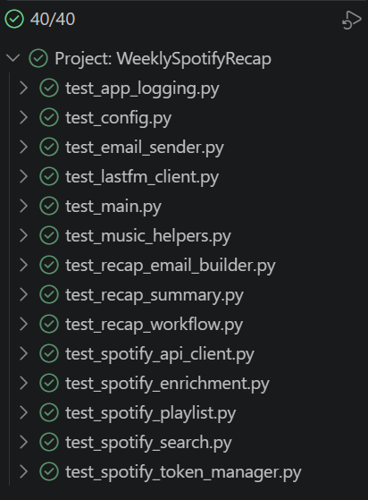

# Testing Protocol

Date: 19.06.2026

Project: Weekly Spotify Recap

Testing type: White-box unit testing with Python `unittest`

## Test Setup

The tests can be run with a command or with the Visual Studio Code testing
extension.

Command:

```powershell
$env:PYTHONPATH="src"
py -m unittest discover -p "test_*.py" -v
```

Testing extension:

Open the Testing view in Visual Studio Code and run the discovered `unittest`
tests from there. The workspace settings are configured for the root-level
`test_*.py` files.

The tests use fake environment variables and mocks. They do not call Last.fm,
Spotify, or Gmail.

## MoSCoW Scope Used For Testing

The tests focus on the documented project proposal:

- Must: collect weekly listening data, identify top songs/albums/artists,
  calculate listening statistics, create a top-songs playlist, and send an
  email recap with the playlist link.
- Should: use a Spotify-inspired email design, show rankings and listening
  time, display the playlist link clearly, and handle API/email errors.
- Could: include images and clickable Spotify links.
- Extra kept by request: upload a custom Spotify playlist image.

## Test Coverage By Module

| Module | Test file | Main criteria |
| --- | --- | --- |
| `app_logging.py` | `test_app_logging.py` | Log file creation and logging helper messages |
| `main.py` | `test_main.py` | Entry point call, network error, SMTP error |
| `config.py` | `test_config.py` | Required env values, missing env error, `.env` parsing |
| `email_sender.py` | `test_email_sender.py` | SMTP login and email sending |
| `lastfm_client.py` | `test_lastfm_client.py` | Last.fm success, API error, weekly filtering |
| `music_helpers.py` | `test_music_helpers.py` | Name matching and listening estimate |
| `recap_email_builder.py` | `test_recap_email_builder.py` | Email sections and playlist button behavior |
| `recap_summary.py` | `test_recap_summary.py` | Recap counts and empty input edge case |
| `recap_workflow.py` | `test_recap_workflow.py` | Happy path and no-track edge case |
| `spotify_api_client.py` | `test_spotify_api_client.py` | API error handling and cover upload endpoint |
| `spotify_enrichment.py` | `test_spotify_enrichment.py` | Spotify image/link enrichment |
| `spotify_playlist.py` | `test_spotify_playlist.py` | Playlist update, track URI selection, cover upload |
| `spotify_search.py` | `test_spotify_search.py` | Spotify track matching |
| `spotify_token_manager.py` | `test_spotify_token_manager.py` | Token caching and missing refresh token |

## Latest Test Result

```text
Ran 40 tests

OK
```

## Test Evidence

Visual Studio Code Testing view:



```text
40/40 tests passed

Project: WeeklySpotifyRecap
test_app_logging.py
test_config.py
test_email_sender.py
test_lastfm_client.py
test_main.py
test_music_helpers.py
test_recap_email_builder.py
test_recap_summary.py
test_recap_workflow.py
test_spotify_api_client.py
test_spotify_enrichment.py
test_spotify_playlist.py
test_spotify_search.py
test_spotify_token_manager.py
```

Command-line test log:

```text
test_configure_logging_writes_expected_levels_to_file (test_app_logging.AppLoggingTests.test_configure_logging_writes_expected_levels_to_file) ... ok
test_logging_helpers_write_expected_messages (test_app_logging.AppLoggingTests.test_logging_helpers_write_expected_messages) ... ok
test_remove_old_log_entries_keeps_only_recent_entries (test_app_logging.AppLoggingTests.test_remove_old_log_entries_keeps_only_recent_entries) ... ok
test_config_module_imports_with_test_environment (test_config.ConfigTests.test_config_module_imports_with_test_environment) ... ok
test_load_dotenv_reads_key_value_pairs (test_config.ConfigTests.test_load_dotenv_reads_key_value_pairs) ... ok
test_required_env_raises_for_missing_value (test_config.ConfigTests.test_required_env_raises_for_missing_value) ... ok
test_required_env_returns_existing_value (test_config.ConfigTests.test_required_env_returns_existing_value) ... ok
test_send_email_logs_in_and_sends_message (test_email_sender.EmailSenderTests.test_send_email_logs_in_and_sends_message) ... ok
test_get_all_tracks_last_7_days_filters_old_tracks (test_lastfm_client.LastFmClientTests.test_get_all_tracks_last_7_days_filters_old_tracks) ... ok
test_get_recent_tracks_page_builds_lastfm_params (test_lastfm_client.LastFmClientTests.test_get_recent_tracks_page_builds_lastfm_params) ... ok
test_lastfm_get_raises_for_api_error_body (test_lastfm_client.LastFmClientTests.test_lastfm_get_raises_for_api_error_body) ... ok
test_lastfm_get_returns_json_happy_path (test_lastfm_client.LastFmClientTests.test_lastfm_get_returns_json_happy_path) ... ok
test_main_calls_recap_workflow (test_main.MainTests.test_main_calls_recap_workflow) ... ok
test_run_handles_network_error (test_main.MainTests.test_run_handles_network_error) ... ok
test_run_handles_smtp_authentication_error (test_main.MainTests.test_run_handles_smtp_authentication_error) ... ok
test_estimate_listening_hours_uses_average_song_length (test_music_helpers.MusicHelpersTests.test_estimate_listening_hours_uses_average_song_length) ... ok
test_exact_name_match_matches_normalized_values (test_music_helpers.MusicHelpersTests.test_exact_name_match_matches_normalized_values) ... ok
test_find_album_for_track_returns_unknown_for_missing_track (test_music_helpers.MusicHelpersTests.test_find_album_for_track_returns_unknown_for_missing_track) ... ok
test_normalize_name_removes_case_and_symbols (test_music_helpers.MusicHelpersTests.test_normalize_name_removes_case_and_symbols) ... ok
test_relaxed_album_match_handles_roman_numerals (test_music_helpers.MusicHelpersTests.test_relaxed_album_match_handles_roman_numerals) ... ok
test_build_html_email_contains_main_sections (test_recap_email_builder.EmailHtmlTests.test_build_html_email_contains_main_sections) ... ok
test_build_html_email_contains_mobile_row_styles (test_recap_email_builder.EmailHtmlTests.test_build_html_email_contains_mobile_row_styles) ... ok
test_build_html_email_hides_playlist_button_without_url (test_recap_email_builder.EmailHtmlTests.test_build_html_email_hides_playlist_button_without_url) ... ok
test_build_html_email_shows_counts_without_play_label (test_recap_email_builder.EmailHtmlTests.test_build_html_email_shows_counts_without_play_label) ... ok
test_build_summary_counts_weekly_statistics (test_recap_summary.RecapSummaryTests.test_build_summary_counts_weekly_statistics) ... ok
test_build_summary_handles_empty_tracks (test_recap_summary.RecapSummaryTests.test_build_summary_handles_empty_tracks) ... ok
test_run_recap_runs_full_happy_path_with_mocks (test_recap_workflow.RecapWorkflowTests.test_run_recap_runs_full_happy_path_with_mocks) ... ok
test_run_recap_stops_when_no_tracks_found (test_recap_workflow.RecapWorkflowTests.test_run_recap_stops_when_no_tracks_found) ... ok
test_spotify_request_raises_clear_error_for_403 (test_spotify_api_client.SpotifyApiTests.test_spotify_request_raises_clear_error_for_403) ... ok
test_spotify_request_wraps_http_error_details (test_spotify_api_client.SpotifyApiTests.test_spotify_request_wraps_http_error_details) ... ok
test_upload_playlist_cover_uses_image_endpoint (test_spotify_api_client.SpotifyApiTests.test_upload_playlist_cover_uses_image_endpoint) ... ok
test_enrich_summary_with_spotify_builds_sections (test_spotify_enrichment.SpotifyEnrichmentTests.test_enrich_summary_with_spotify_builds_sections) ... ok
test_create_or_update_raises_when_no_spotify_tracks_found (test_spotify_playlist.SpotifyPlaylistTests.test_create_or_update_raises_when_no_spotify_tracks_found) ... ok
test_create_or_update_updates_playlist (test_spotify_playlist.SpotifyPlaylistTests.test_create_or_update_updates_playlist) ... ok
test_get_top_track_uris_deduplicates_tracks (test_spotify_playlist.SpotifyPlaylistTests.test_get_top_track_uris_deduplicates_tracks) ... ok
test_upload_cover_if_available_returns_false_when_missing (test_spotify_playlist.SpotifyPlaylistTests.test_upload_cover_if_available_returns_false_when_missing) ... ok
test_find_spotify_track_returns_matching_track (test_spotify_search.SpotifySearchTests.test_find_spotify_track_returns_matching_track) ... ok
test_find_spotify_track_returns_none_without_match (test_spotify_search.SpotifySearchTests.test_find_spotify_track_returns_none_without_match) ... ok
test_get_spotify_app_token_caches_access_token (test_spotify_token_manager.SpotifyAuthTests.test_get_spotify_app_token_caches_access_token) ... ok
test_get_spotify_user_token_requires_refresh_token (test_spotify_token_manager.SpotifyAuthTests.test_get_spotify_user_token_requires_refresh_token) ... ok

----------------------------------------------------------------------
Ran 40 tests in 0.060s

OK
```
